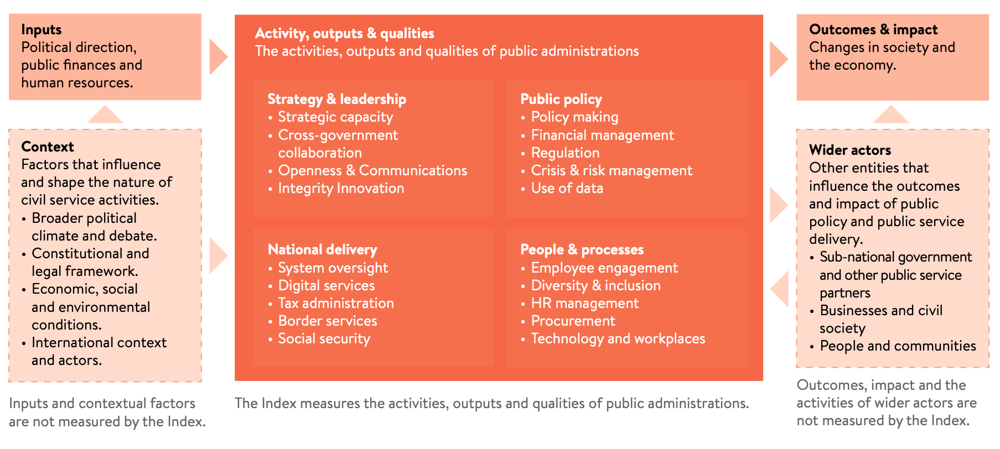

---
format:
  html:
    subtitle: | 
      The framework the Index uses to describe the facets of public
      administrations and civil services.
source_document: https://index.bsg.ox.ac.uk/posts/framework/
order: 102
---

# Conceptual framework {#sec-conceptual-framework}

In order to create an Index, a framework is needed that we can use to
conceptually describe the activities and characteristics of a public
administration and to align source data against. Our intention is for the
framework to not only provide a theoretical underpinning to the Index but also
ensure it is usable by practitioners. The conceptual framework for the
Blavatnik Index of Public Administration builds on that developed for the
InCiSE Index, but based on desk research and feedback from academic and
practitioner stakeholders it adopts a restructured and expanded framework.

{#fig-framework}

The core focus of the Index are the activities, characteristics and outputs of
public administrations. These are organised into four domains that provide a
high-level structure for thinking about the activities of public
administrations:

- **Strategy and Leadership** – measuring activities that steer and coordinate
  the functioning of the public administration as well as the characteristics
  and values that support the stewardship of the institutions of the public
  administration.
- **Public Policy** – measuring the core executive activities of public
  administrations in support of the country’s national government.
- **National Delivery** – measuring public services delivered directly by
  national governments and the oversight of other systems of public service
  delivery.
- **People and Processes** – measuring the activities and characteristics in
  support of the public administration’s workforce.

In addition to the core components that are measured by the Index, our
framework also identifies the aspects about the wider context which public
administrations are situated within but are not measured by the Index.

Civil services and public administrations exist to execute the practical work
of government, they take inputs (political direction, public finances and human
resources) and turn them into outcomes and impact (economic, social and
environmental changes). Public administrations also operate within their own
national context (constitutional and legal frameworks; national political
climate and debate; economic, social and environmental conditions; and,
international context and actors) which can influence both the inputs they have
available to them as well as their capacity to act or scope for action. There
are also other actors (sub-national governments and other public service
entities; businesses and civil society actors; communities and individual
citizens) who influence the outcomes and impact of public policy and service
delivery.

## Strategy and Leadership domain {#sec-strategy-leadership-domain}

The Strategy and Leadership domain seeks to assess the setting of the strategic
direction for the government’s programme of work, the stewardship of public
institutions, and the overarching values that guide the behaviours of and
approach taken by public officials. It is made up of five themes: strategic
capacity; cross-government collaboration; openness and communications;
integrity; and, innovation.

### Strategic capacity {#sec-strategic-capacity-theme}

The strategic capacity theme seeks to measure the ability of the centre of
government to set strategic direction and to ensure that the institutional
structure of government remains fit for purpose. Centres of government support
the political leader(s) of a national government and as such need to both set
out a vision that other ministries and agencies can follow as well as ensure
organisations have the resources and capacities to achieve the objectives they
are tasked with [@barber_how_2016].

### Cross-government collaboration {#sec-xgov-collaboration-theme}

The cross-government collaboration theme seeks to measure the extent to which
different parts of the national government work together in the development of
policy or the delivery of services. In particular it aims to focus on voluntary
collaboration, i.e. where ministries and agencies chose to work together in
pursuit of a common goal (e.g. setting up a joint project team) rather than
where they are mandated to work together as a result of other processes (e.g.
debating policy proposals in a cabinet committee). Modern policy challenges are
increasingly cross-sectoral in nature, necessitating multi-agency or
whole-of-government responses [@verschuuren_dutch_2020]. Such multi-agency
collaboration must be more than formal committee processes, successful
multi-agency collaboration fosters collective focus on the government-wide
object rather than the narrower interests of specific ministries or
programmes [@brown_tools_2021].

### Openness and communications {#sec-openness-communications-theme}

The openness and communications theme seeks to measure: the extent to which
governments consult with citizens and stakeholders in policy development; the
extent to which laws, regulations and government information is publicly
available. The @world_bank_group_world_2017 notes that “transparency
initiatives [are] an important first step toward increasing accountability”.
@ball_what_2009 summarises the uses of transparency in three metaphors: (i)
'a public norm to counter corruption'; (ii) open government and decision
making; and, (iii) transparency via evaluation of policy actions and programmes.

### Integrity {#sec-integrity-theme}

The integrity theme seeks to measure the extent to which public officials make
decisions and exercise their duties impartially and do not engage in corruption;
integrity is often identified as a core value associated with public service.
The @international_civil_service_commission_standards_2013 highlights the
importance of integrity to the work of the United Nations (UN) common systems
staff: “The concept of integrity … embraces all aspects of behaviour of an
international civil servant … including … honesty, truthfulness, impartiality
and incorruptibility. These qualities are as basic as those of competence and
efficiency”. Many studies of good governance have used measures of integrity in
their analyses, for instance @muriithi_quantifying_2015.

### Innovation {#sec-innovation-theme}

The innovation theme seeks to measure the degree to which new ideas, policies,
and ways of operating are able to develop freely. The importance of innovation
for public sector organisations has been identified for over decade
[@oecd_innovation_2015]. @mulgan_innovation_2014 argues that innovation needs
to be treated ‘with the same seriousness they deal with handling risk, financial
controls or regulatory enforcement’.

## Public Policy domain {#sec-public-policy-domain}

The Public Policy domain seeks to assess the core public administration
functions, the activities that are fundamental for any national government. It
is made up of five themes: policy making; financial management; regulation;
crisis and risk management; and, the use of data.

### Policymaking {#sec-policymaking-theme}

The policymaking theme seeks to measure the extent to which governments can
develop effective policy. The formulation and implementation of sound policy is
an essential function of government [@kaufmann_governance_1999]. The
@oecd_recommendation_2012 note the importance of high quality policy
development and advice as a core requirement for good governance.

### Financial management {#sec-financial-management-theme}

The financial management theme seeks to measure the extent to which governments
manage public money effectively. @holt_fukuyama_2014 note that
fiscal and financial management is one of the central management systems of
public administrations. While the mere adoption of a fiscal rule does not
guarantee better fiscal performance, the latest cross-country analysis finds
that well-designed fiscal rules are associated with lower government deficits,
debts, and borrowing costs [@hughes_britannia_2019].

### Regulation {#sec-regulation-theme}

The regulation theme seeks to measure the use of impact assessment in the
development of regulations and that regulations are enforced properly and
efficiently. The @oecd_recommendation_2012 “recognis[es] that regulations are
one of the key levers by which governments act to promote economic prosperity,
enhance welfare and pursue the public interest” and that “well designed
regulations can generate significant social and economic benefits which out
weigh the costs of regulation, and contribute to social well-being”. While
@torfing_enhancing_2016 argue the importance of the
collaborative development of regulation with citizens, proactive regulation
can be a lever for social change, @aksoy_laws_2020 note that
regulations legalising same-sex partnerships/marriages have led to increased
acceptance of homosexuality in Europe.

### Crisis and risk management {#sec-crisis-risk-theme}

The crisis and risk management theme seeks to measure how well governments
prepare for and manage critical risks to the functioning of their country’s
society and economy. @baubion_oecd_2013 highlights crisis management
as central to government’s role and a “fundamental element of good governance”.
@christensen_crisis_2011 discusses how credibility and trust in governments to
deal with crises is vital both to reassure and encourage support from the
private sector and general public.

### Use of data {#sec-use-of-data-theme}

The use of data theme seeks to measure the extent to which governments have the
data, information and skills necessary to develop policy and deliver public
services. The importance and role of evidence-informed policy making is long
understood [@langer_science_2016], the effective use of management
information is also critical for improving the performance and operation of
front-line services [@brown_tools_2021].

## National Delivery domain {#sec-national-delivery-domain}

The National Delivery domain seeks to assess the ability of the national
government to oversee the delivery of public services, including those
services it delivers itself. It should be noted that the responsibility and
nature of public sector delivery varies considerably between jurisdictions,
the Index does not and cannot seek to be a comprehensive comparative assessment
of all types of public service delivery. Deliberately, the Index has sought to
avoid services which are highly varied in their constitutional/operational
arrangements and/or where their delivery is highly tied policy goals (e.g.
health, education, labour market). This domain is made up of five themes:
system oversight; digital services; tax administration; border services; and,
social security.

### System oversight {#sec-system-oversight-theme}

The system oversight theme seeks to measure the extent to which the government
can achieve its policy objectives through its own means and through leadership
and stewardship of wider delivery systems. Centres of government have an
important role in holding ministries, agencies and others involved in the
achievement of policy goals, to account and monitor progress
[@barber_how_2016], effective central units also use their monitoring
and accountability functions to collaboratively support and assist line
ministries to achieve their objectives [@brown_tools_2021].

### Digital services {#sec-digital-services-theme}

The digital services theme seeks to measure the government’s support for
digital public services through the strategies and policies that support their
development, the technologies that enable them to work effectively, and the end
user experience. As identified by @sullivan_accelerated_2021 the
digitization of services has become mandatory rather than preferable, because
digital services can offer sizeable benefits in the speed, reliability,
accuracy, and convenience of service provision [@hinkley_technology_2022].

### Tax administration {#sec-tax-administration-theme}

The tax administration theme seeks to measure the operational quality of a
country’s national level tax administration. @fukuyama_what_2013
argues that taxation is a “necessary foundation of all states”, while
@holt_fukuyama_2014 highlight the importance of tax administration in
measuring the effectiveness of public administration.

### Border services {#sec-border-services-theme}

The border services theme seeks to measure the operational quality of a
country’s national borders, the extent to which legitimate goods/services can
be transacted across the border and ease with which tourists and business
visitors can enter/leave the country. The @imf_fiscal_2012 notes that
customs are often a bell-weather for the degree of corruption and arbitrariness
in the public sector, and that effective reform can help improve perceptions of
a country’s institutions. The adoption of “single-window” systems for customs
operations are seen as crucial development in improving the efficiency of
customs operations [@unece_recommendation_2020]. International migration (i.e.
the movement of people to move for medium- to long-term periods) is excluded as
this is closely associated with policy intentions, with some countries having
policy to explicitly encourage in-migration while others try to limit either
in-migration or out-migration.

### Social security {#sec-social-security-theme}

The social security theme seeks to measure the operational quality of a
country’s national social security system. @chalam_governance_2014 notes
that social security systems have “played an important role to alleviate
poverty and provide economic security” in all successful societies and
economies, moreover @mckinnon_good_2011 notes that “several legal instruments
adopted by the United Nations recognised social security as a basic
human right”.

## People and Processes domain {#sec-people-processes-domain}

While the first three domains focus on the operational functioning of the
public administration, in effect “what” public administrations do or “how” they
do it, the People and Processes domain seeks to assess what and how it feels to
work in or for the public administration. It is made up of five themes:
employee engagement; diversity and inclusion; HR management; procurement; and,
technology and workplaces.

### Employee engagement {#sec-employee-engagement-theme}

The employee engagement theme seeks to measure the extent to which those
working in the public administration feel a sense of commitment and motivation
to their work and have sufficient support and development to do their jobs
well. Engaged employees enable staff “to give their best and to help [their
organisation] succeed – and from that flows a series of tangible benefits for
[the] organisation and individual alike” [@macleod_engaging_2009],
@borst_attitudinal_2020 find that the relationships between work engagement and
other beneficial work-related attitudes tend to be stronger for public sector
employees than for those in the private sector.

### Diversity and inclusion {#sec-diversity-inclusion-theme}

The diversity and inclusion theme seeks to measure the extent to which the
public administration workforce reflects the population and society it serves.
@apfelbaum_rethinking_2014 show that workforce diversity improves the quality
and impartiality of decisions, while @talmor_solving_2022 argues when some
groups are not represented or are misrepresented that anger and mistrust of
institutions follows. The @oecd_government_2015 identifies that “a more
representative public administration can better access previously overlooked
knowledge, networks and perspectives for improved policy development and
implementation”.

### HR management {#sec-hr-management-theme}

The HR management theme seeks to measure the formal practices that govern the
recruitment and management of an effective public administration workforce. As
@bovaird_public_2023 note “around 70 per cent of the budgets of most public
organisations are spent on staff” and thus “if the HR policies are not right,
then public organisations will not attract the human resources they need to
perform the functions of government and deliver the services that government
has promised the electorate”. @fukuyama_what_2013 recognises that proper
recruitment and reward of public servants “remain at the core of any measure of
quality of governance” as well as the importance of merit in recruitment and
promotion.

### Procurement {#sec-procurement-theme}

The procurement theme seeks to measure the operational quality of public
procurement practices. The @world_bank_global_2020 notes that “public
procurement accounts on average for 13% to 20% of GDP”, and that “\[procurement\]
can play a strategic role in delivering more effective public services”
[@world_bank_benchmarking_2016].

### Technology and workplaces {#sec-technology-workplaces-theme}

The technology and workplaces theme seeks to measure the enabling environment
for public employees, the IT systems they use, the buildings they work in and
the ways they work. It has long been recognised that governments need to keep
up with technological advances, leveraging technology to “enhance the speed
and efficiency of operations, by streamlining processes, lowering costs”
[@madzova_e-government_2013], adopting modern workplace technologies
also helps officials to be more agile, creative and innovative in addition to
enhancing productivity [@oecd_skills_2017]. While there were moves to
support remote working and leverage the opportunities of online technologies
for collaboration, the COVID-19 pandemic presented a revolutionary moment for
the uptake of these technologies as many governments mandated most or all of
their workforces to work from home to combat the spread of the pandemic, in the
post-pandemic period there are opportunities to realise continued benefits by
continuing to support more diverse ways of working [@oecd_public_2023].
