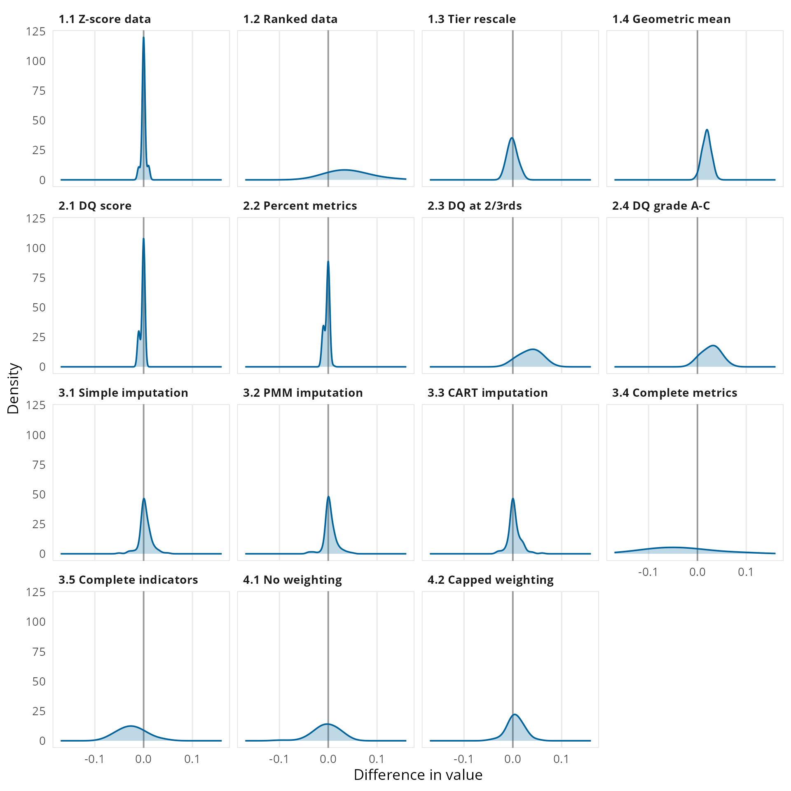
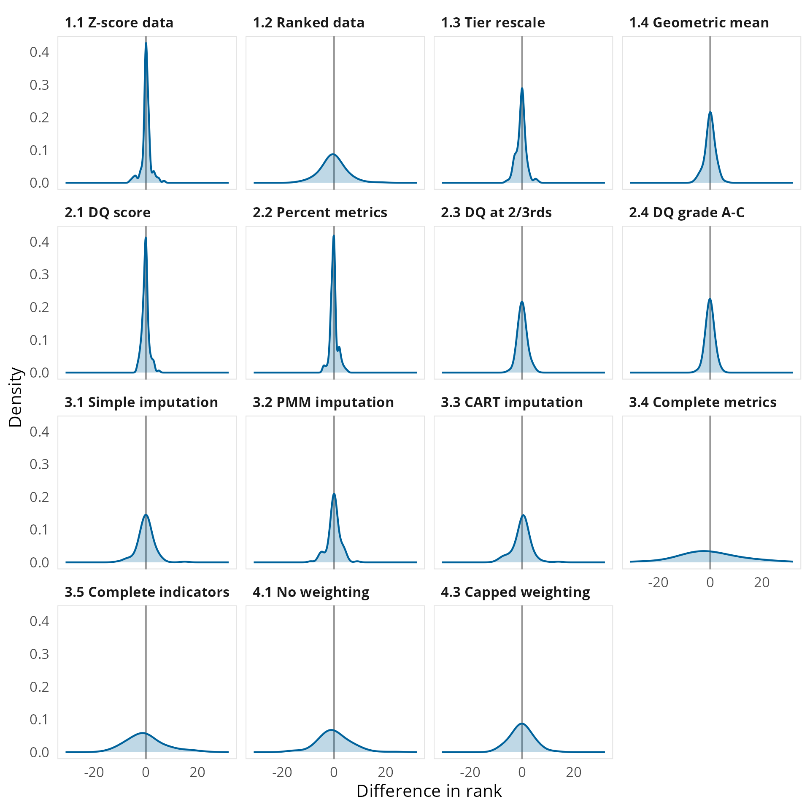
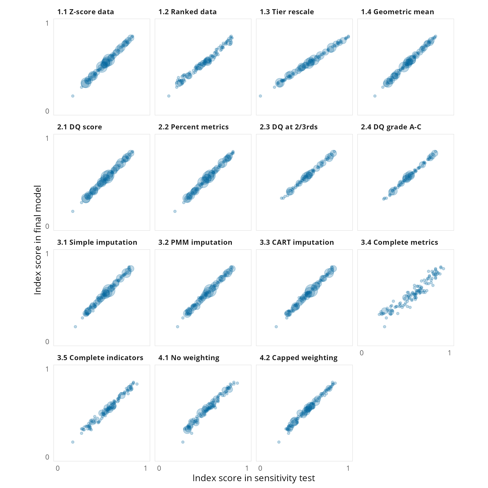

---
format:
  html:
    subtitle: | 
      How we have tested the robustness of different aspects the Index's
      methodology.
source_document: https://index.bsg.ox.ac.uk/posts/sensitivity_analysis/
order: 111
---

# Sensitivity analysis {#sec-sensitivity_analysis}

The construction of any model and index involves a number of steps that are
ultimately based on specific methodological choices, documented in the previous
sections of this report. This section analyses the results of 14 tests carried
out assess the robustness of these choices.

## Types of sensitivity tests conducted

@tbl-sensitivity-tests outlines the 14 different tests carried out, these have
been grouped into four sets:

- Scaling and aggregation tests, which vary how the modelling scales data both
  in its sources and in its aggregation.
- Coverage tests, which vary the countries included in the modelling.
- Missing data tests, which vary how the modelling treats missing data.
- Weighting tests, which vary how the modelling approaches the weighting of data.

```{r}
#| label: tbl-sensitivity-tests
#| tbl-cap: Summary of sensitivity tests

source("R/out_table.R")

tibble::tribble(
  ~test_group, ~test_id, ~test_title, ~test_description,
  "scaling_aggregation", 1.1, "Z-score data", "Source data is converted to z-scores before its conversion to metrics",
  "scaling_aggregation", 1.2, "Ranked data", "After transformations the data for the metrics are ranked and scaled from 0 to 1",
  "scaling_aggregation", 1.3, "Tier rescale", "Country scores are re-scaled from 0 to 1 after each level of aggregation",
  "scaling_aggregation", 1.4, "Geometric mean", "Aggregation calculated using the geometric mean rather than the arithmetic mean",
  "coverage", 2.1, "DC score", "Country selection based only on the data coverage score",
  "coverage", 2.2, "Percent metrics", "Country selection based only on the percent of metrics",
  "coverage", 2.3, "DC at two-thirds", "Country selection using data coverage threshold is harmonised with the threshold for the percent of metrics",
  "coverage", 2.4, "DC grades A-C", "Country selection using higher thresholds for both data coverage and percent of metrics",
  "missing_data", 3.1, "Simple imputation", "Missing data replaced using geographic and income group means",
  "missing_data", 3.2, "PMM imputation", "Missing data replaced using predictive mean matching (PMM)",
  "missing_data", 3.3, "CART imputation", "Missing data replaced using classification and regression trees (CART)",
  "missing_data", 3.4, "Complete metrics", "Index calculated using only the 23 metrics with near complete coverage (119-120 countries)",
  "missing_data", 3.5, "Complete indicators", "Index calculated using only the 17 indicators with near complete coverage (119-120 countries)",
  "weighting", 4.1, "No weighting", "Index calculated as a simple average of all metrics (i.e. no implicit weighting from the data model)",
  "weighting", 4.2, "Capped weights", "Index calculated capping weights implied by the data model",
) |>
  dplyr::mutate(
    test_group = stringr::str_to_sentence(
      paste(gsub("_", " ",test_group), "tests")
    ),
    test_group = forcats::fct_reorder(test_group, test_id, min),
    test_name = paste(test_id, test_title)
  ) |>
  dplyr::select(test_group, test_name, test_description) |>
  gt::gt(groupname_col = "test_group") |>
  gt::cols_label(
    test_name ~ "Sensitivity test",
    test_description ~ "Test description"
  ) |>
  gt::cols_width(
    test_name ~ gt::pct(25),
    test_description ~ gt::pct(75)
  ) |>
  out_table()

```

## Analysis of sensitivity tests

For each sensitivity test the relevant methodological change is applied and the
Index calculated with all other choices remaining the same as the final model.
The test Index scores are then compared to the Index scores in the final model.
For each model the following comparison statistics have been calculated, these
are presented in @tbl-test-results, @fig-sens-value, @fig-sens-rank, and @fig-sens-scatter.

- Difference in coverage – the difference in the number of countries included
  in the final model and the number of countries in the sensitivity test.
- Difference in index score
    - Any difference in score – the number of countries with any difference
      between their index score calculated in the final model and their index
      score calculated in the sensitivity test.
    - Difference in score ±0.05 – the number of countries with a difference
      between their index score in the final model and their index score in
      the sensitivity test.
    - Mean difference in score – the mean of the differences between index
      scores in the final model and index scores in the sensitivity test.
    - Mean absolute difference in score - the mean of the absolute differences
      between index scores in the final model and index scores in the
      sensitivity test.
- Differences in rank
    - Any difference in score – the number of countries with any difference
      between their index score calculated in the final model and their index
      score calculated in the sensitivity test.
    - Difference in score ±0.05 – the number of countries with a difference
      between their index score in the final model and their index score in
      the sensitivity test.
    - Mean difference in score – the mean of the differences between index
      scores in the final model and index scores in the sensitivity test.
    - Mean absolute difference in score - the mean of the absolute differences
      between index scores in the final model and index scores in the
      sensitivity test.
- Correlations
    - The Pearson correlation coefficient between the index scores in the
      final model and the index scores in the sensitivity test.
    - The Kendall rank correlation (tau) correlation between the index scores
      in the final model and the index scores in the sensitivity test.

:::{.landscape}

``` {r}
#| label: tbl-test-results
#| tbl-cap: Results of the sensitivity tests
test_results <- readr::read_csv(
  file.path("data", "bipa2024_sensitivity_results.csv"), show_col_types = FALSE
)

test_results |>
  dplyr::select(-sens_test, -p_pearson, -p_kendall) |>
  gt::gt() |>
  gt::cols_label(
    sens_test_label ~ "Sensitivity test",
    n_countries ~ "Difference in coverage",
    n_value_diff ~ "Any difference in score",
    n_value_diff5 ~ "Difference of score ≥ ±0.05",
    value_diff ~ "Mean difference in score",
    value_diff_abs ~ "Mean absolute difference in score",
    n_rank_diff ~ "Any difference in rank",
    n_rank_diff5 ~ "Difference in rank ≥ 5",
    rank_diff ~ "Mean difference in rank",
    rank_diff_abs ~ "Mean absolute difference in rank",
    out_pearson ~ "Pearson (r)",
    out_kendall ~ "Kendall (tau)"
  ) |>
  gt::tab_spanner(
    label = "Difference in score", columns = contains("value_diff")
  ) |>
  gt::tab_spanner(
    label = "Difference in rank", columns = contains("rank_diff")
  ) |>
  gt::tab_spanner(
    label = "Correlations", columns = starts_with("out_")
  ) |>
  gt::tab_row_group(
    label = "Scaling aggregation tests",
    rows = grepl("^1", sens_test_label)
  ) |>
  gt::tab_row_group(
    label = "Coverage tests",
    rows = grepl("^2", sens_test_label)
  ) |>
  gt::tab_row_group(
    label = "Missing data tests",
    rows = grepl("^3", sens_test_label)
  ) |>
  gt::tab_row_group(
    label = "Weighting tests",
    rows = grepl("^4", sens_test_label)
  ) |>
  gt::fmt_number(columns = starts_with("n_"), decimals = 0) |>
  gt::fmt_number(columns = n_countries, decimals = 0, force_sign = TRUE) |>
  gt::fmt_number(columns = value_diff, decimals = 2, force_sign = TRUE) |>
  gt::fmt_number(columns = value_diff_abs, decimals = 2) |>
  gt::fmt_number(columns = rank_diff, decimals = 1, force_sign = TRUE) |>
  gt::fmt_number(columns = rank_diff_abs, decimals = 1) |>
  gt::fmt_number(columns = c(out_pearson, out_kendall), decimals = 3) |>
  gt::sub_missing(missing_text = "") |>
  gt::cols_width(
    sens_test_label ~ gt::pct(12),
    n_countries ~ gt::pct(8),
    n_value_diff ~ gt::pct(8),
    n_value_diff5 ~ gt::pct(8),
    value_diff ~ gt::pct(8),
    value_diff_abs ~ gt::pct(8),
    n_rank_diff ~ gt::pct(8),
    n_rank_diff5 ~ gt::pct(8),
    rank_diff ~ gt::pct(8),
    rank_diff_abs ~ gt::pct(8),
    out_pearson ~ gt::pct(8),
    out_kendall ~ gt::pct(8)
  ) |>
  out_table()

```

:::

{#fig-sens-value}

{#fig-sens-rank}

{#fig-sens-scatter}


Overall, most tests do not see any substantial variation in score, there is
more variation in rank but on average this remains low. All sensitivity tests
have strong correlations with the final index scores, whether using Pearson’s
correlation or the more robust Kendall tau measure.

The largest variations are seen in the tests when restricting to those
metrics/indicators with near-complete data, however these still show strong
correlation with the final index. The data from these tests are restricted to
only a few data sets and a much narrower coverage of the Index’s framework, so
while they have near complete data they are not necessarily a good
representation the Index’s intended focus. There is also some volatility when
adjusting for the weighting of variables, however it should be noted that this
approach also includes imputation of missing data before the re-weighting of
data. 

Across the 14 tests, the country that ranks first in the final model ranks
first in 5 of the tests. Three other countries rank first in other tests (one
four times, one 3 times, one twice), all three of these countries rank either
2nd or joint 3rd in the final model. Of the countries that rank first, second
or third in the final model, only on 7 instances do they not rank inside the
top 3 and in all occasions they rank within the top 10.

## Details of the sensitivity tests

### Scaling and aggregation tests

There are four scaling and aggregation tests, two of these adapt the source data
and two handle scaling during the aggregation data into the overall Index and
its component scores.

#### Z-score source data (test 1.1)

In this test each variable in the source data is normalised into a z-score (the
difference from the variable mean, divided by the standard deviation of the
variable) before being input into the model. Each variable has its own original
scaling and its own distribution of scores, while the min-max normalisation
converts all metrics to a common scale it does not account for the intrinsic
distribution of the variables. By normalising all variables into units of
standard deviation this test seeks to assess the extent to which the intrinsic
measurement scales of each variable influences how countries score.

#### Ranked data (test 1.2)

In this test after their initial conversion the metric scores are ranked and
then these are reconverted from 0 to 1 using min-max normalisation. While it
would be preferable to rank the source data, some metrics use distance
calculations as part of their transformation, therefore the ranking is performed
on the initial calculation of metric scores. As with the z-score test, the aim
of this test is to test the impact of the intrinsic measurement scale, using
ranks provides non-parametric assessment of this impact.

#### Tier rescale (test 1.3)

In this test the scores for each tier of the Index’s data model are re-scaled
from 0 to 1 after their calculation, in the final model this re-scaling only
occurs at the calculation of the first tier of the model. This approach was used
by the InCiSE 2019 Index. Owing to the original distributions in the source data
the distributions of the Index’s domains (and themes) are evenly not balanced,
the people and process domain has a notably tighter distribution with higher
average scores than the distribution of the strategy and leadership domain.
Through re-scaling at each tier, this test aims to assess the impact of the
attribution of source data to different parts of the data model by ensuring that
countries at the relative bottom and top of each tier of the data model are more
fairly “rewarded” or “penalised” for their performance.

#### Geometric mean (test 1.4)

In this test aggregation is made using the geometric mean rather than the
arithmetic mean. The arithmetic mean can be strongly influenced by outlier
performance, by using the geometric mean this test aims to assess the extent to
which country scores are influenced by any outlier performance. The geometric
mean is often used to summarise normalised values
(https://doi.org/10.1145/5666.5673), however as it is a less intuitive
calculation for non-statisticians we have preferred the arithmetic mean. The
geometric mean is also intended for use with non-zero positive numbers, to
account for when calculating the geometric mean all the metric values had 1
added to them (i.e. the metrics range from 1 to 2), with 1 then subtracted after
calculating the final tier so as to return the Index to its intended 0 to 1
range.

### Coverage tests

There are four tests which modify the criteria used for country selection. There
are two criteria used for country selection, a country’s data coverage score and
its overall percent of metrics. The data coverage score assesses the spread of a
country’s available data across the Index’s conceptual framework, there are four
themes with 10 or more metrics, while there are six themes with only 1 or 2
metrics. Theoretically a country could achieve a high proportion of metrics with
data in only a few of the 17 themes, the data coverage score is a method to
account for this discrepancy. The overall percent of metrics is used as a second
criteria to ensure that countries overall have at least a significant amount of
data contributing to their calculations. To qualify for inclusion countries
needed a data coverage score that was at least half the maximum possible score
(the score if a country has a complete set of data) and had a least two-thirds
of metrics overall.

#### Data coverage (DC) score only (test 2.1)

In this test country selection is based solely on a country’s data coverage
score. There are 8 countries which pass the threshold for this score but have
less than two-thirds of metrics overall (ranging from 54% to 65%):

:::{layout-ncol="2"}
:::{}
- Barbados
- Bhutan
- Burundi
- Central African Republic
:::
:::{}
- Gabon
- Saint Lucia
- Maldives
- Timor-Leste (East Timor)
:::
:::

#### Percent of metrics only (test 2.2)

In this test country selection is based solely on a country’s overall percent of
metrics available. There are five countries which have more than two-thirds of
metrics (ranging from 67% to 73%) but which do not meet the data coverage
threshold:

:::{layout-ncol="2"}
:::{}
- Afghanistan
- Cote d’Ivoire
- Democratic Republic of the Congo
:::
:::{}
- Egypt
- Japan
:::
:::

#### DC at two-thirds (test 2.3)

In this test the threshold for the data coverage threshold is harmonised with
that for the percent of metrics, that is the data coverage threshold is
increased from half to two-thirds of the reference score. There are 35 countries
which are not included in this test:

:::{layout-ncol="2"}
:::{}
- Austria
- Azerbaijan
- Belgium
- Cambodia
- Cameroon
- China
- Eswatini
- Ethiopia
- Gambia
- Germany
- Guinea
- Hong Kong
- Israel
- Italy
- Kosovo
- Lebanon
- Lesotho
- Madagascar
:::
:::{}
- Malawi
- Mauritius
- Montenegro
- Morocco
- Myanmar
- Namibia
- Nicaragua
- Niger
- North Macedonia
- Norway
- Pakistan
- Rwanda
- Saudi Arabia
- Sierra Leone
- Sudan
- Tajikistan
- Tunisia
:::
:::

#### DQ grade A-C (test 2.4)

In this test country selection is limited to those countries with data coverage
graded from A to C. To help easily explain data coverage countries have also
been given a grade from A to F based on the two criteria for inclusion, grades A
to D relate to those selected for inclusion with the thresholds set as the upper
quartile, median and lower quartile of both the data coverage score and percent
of metrics of the 120 countries selected for inclusion. Grades E and F relate to
those not selected for inclusion with the threshold being the median of the data
coverage scores and percent of metrics of those countries and territories not
included. This test excludes those countries included in the main index with
comparatively weaker data coverage, in effect testing the assumption that the
Index score and data coverage are not correlated. There are 36 countries which
are not included in this test:

:::{layout-ncol="2"}
:::{}
- Austria
- Azerbaijan
- Belgium
- China
- Eswatini
- Ethiopia
- Gambia
- Germany
- Guinea
- Hong Kong
- Israel
- Italy
- Kosovo
- Lebanon
- Lesotho
- Madagascar
- Malawi
- Mauritius
:::
:::{}
- Montenegro
- Morocco
- Mozambique
- Myanmar
- Namibia
- Nicaragua
- Niger
- North Macedonia
- Norway
- Pakistan
- Rwanda
- Saudi Arabia
- Sierra Leone
- Singapore
- Sudan
- Tajikistan
- Tunisia
- Zimbabwe
:::
:::

### Missing data tests

There are five tests which explore missing data issues. While the criteria for
country inclusion takes into account data availability, there is only one
country with data for all 86 metrics included in the calculation of the Index.
The calculation of the final Index does not employ any imputation to account for
missing data, as a result there is an implicit assumption that a country’s
performance in their missing data is equivalent to their average performance in
the data we do have for them. These tests seek to adopt alternative approaches
to missing data to test this assumption.

For all but test 3.4 the tests impute missing data for indicators (the second
tier of the Index’s data model). At the metric tier (the first tier of the data
model) there are 10,320 possible data points (86 metrics for 120 countries), of
these possible data points 15.6% (1,611) are missing. Metrics are grouped into
indicators based on whether they conceptually measure highly similar aspects,
for example the corruption indicator is based on three metrics covering public
opinion of whether government officials are involved in corruption, expert
opinions of whether government officials accept favours for bribes and whether
they steal/embezzle public funds. After calculating the indicators we see a
significant reduction in the level of missing data, of the 4,320 possible data
points (36 indicators for 120 countries) now only 6.7% (290) are missing.

#### Simple imputation (test 3.1)

In this test missing data is replaced with scores derived from a country’s
geographic and economic peers. For each indicator the simple arithmetic mean of
our six geographic regions and the four World Bank income classification groups
are calculated. Where a country has missing data for an indicator this is
replaced with a score calculated as half the mean of their geographic region and
half the mean of their income group.

#### Predictive mean matching (PMM) imputation (test 3.2) and classification and regression tree (CART) imputation (test 3.3)

In these two tests missing data is replaced using estimates derived from
statistical modelling. In both cases a similar multiple imputation method is
followed but the selection algorithm is varied, the mice R package (van Buuren
et al) is used to select a set of five candidate values for each missing data
point drawn from the observed values of the variable. An average of these values
is then used as the replacement for the missing data point. The predictive mean
matching (PMM) method uses the correlations of observed data and the pattern of
missing data to identify the countries from which to draw the set of candidate
values. The classification and regression tree (CART) method uses a supervised
learning model to identify the countries from which to draw the set of candidate
values.

#### Complete metrics (test 3.4) and complete indicators (test 3.5)

In these two tests the Index is calculated on a subset of the data model which
have complete or near complete coverage for the countries included in the Index.
Of the 86 metrics included in the Index, 23 have data for 119 or 120 countries.
Of the 36 indicators calculated by the Index, 17 indicators have data for 119 or
120 countries. In each of these tests after calculating results for the given
tier the data is subset to only those metrics or indicators and then subsequent
tiers are calculated from that data.

### Weighting tests

There are two tests which explore approaches to weighting the original source
data. In the final model there are no weights directly applied to the data, this
results in an implicit weighting model based on the data model, however the
actual weight of each metric for each country will vary based on their pattern
of missing data.

#### No weighting (test 4.1)

In this test the index value is calculated as the simple arithmetic mean of all
metrics, i.e. the data is not aggregated through the tiers of the Index’s data
model.

#### Capped weighting (test 4.2)

In this test weights are applied to the metrics in order to cap the implicit
weighting arising from the data model. As outlined in section 11, the implicit
weights for a metric vary from 0.017% to 6.25%. There are 17 metrics with an
implicit weight of 2% or more, which have an implicit aggregate weight of 52%.
This test caps the maximum weight of any individual metric to 2%. For each
metric their implicit weight is calculated and then capped, the residual
available weight is then redistributed evenly amongst all metrics that were not
capped so that the weighting scheme sums to 100%. In order to apply a weighting
structure to the data missing data needs to be imputed, for this, the CART
imputation (test 3.3) was used, as this imputation is at indicator level the
weights for indicators are calculated as the sum of the weights for their
constituent metrics.
